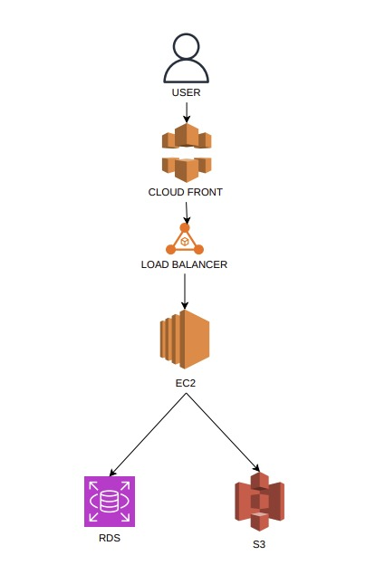

# Smart Inventory Dashboard System

## Deskripsi
Smart Inventory Dashboard System adalah aplikasi berbasis cloud yang digunakan untuk mengelola stok barang secara digital serta menampilkan dashboard monitoring yang interaktif. Sistem ini memungkinkan pengguna untuk mencatat barang masuk dan keluar, mengelola data barang, serta melakukan analisis sederhana terhadap kondisi stok.

Aplikasi ini dibangun dengan memanfaatkan layanan cloud untuk memastikan sistem dapat berjalan secara scalable, aman, dan efisien.

---

## Tujuan
- Mempermudah pengelolaan stok barang
- Mengurangi kesalahan pencatatan manual
- Menyediakan visualisasi data melalui dashboard
- Mengimplementasikan arsitektur cloud computing

---

## Fitur Utama
- Login user (admin)
- Manajemen data barang (CRUD)
- Transaksi barang masuk dan keluar
- Dashboard monitoring:
  - Total stok barang
  - Grafik barang masuk & keluar
  - Notifikasi stok rendah

---

## Arsitektur Sistem
Sistem menggunakan arsitektur berbasis cloud dengan alur:

Penjelasan:
- User mengakses aplikasi melalui browser
- CloudFront berfungsi sebagai CDN untuk mempercepat akses
- Load Balancer mendistribusikan request ke server EC2
- EC2 menjalankan backend aplikasi
- RDS menyimpan data utama sistem
- S3 digunakan untuk penyimpanan file (gambar, dll)

---

## Teknologi yang Digunakan
- Amazon EC2 (Compute)
- Amazon RDS (Database)
- Amazon S3 (Storage)
- Amazon CloudFront (CDN)
- AWS IAM (Security)

---

## Struktur Project
